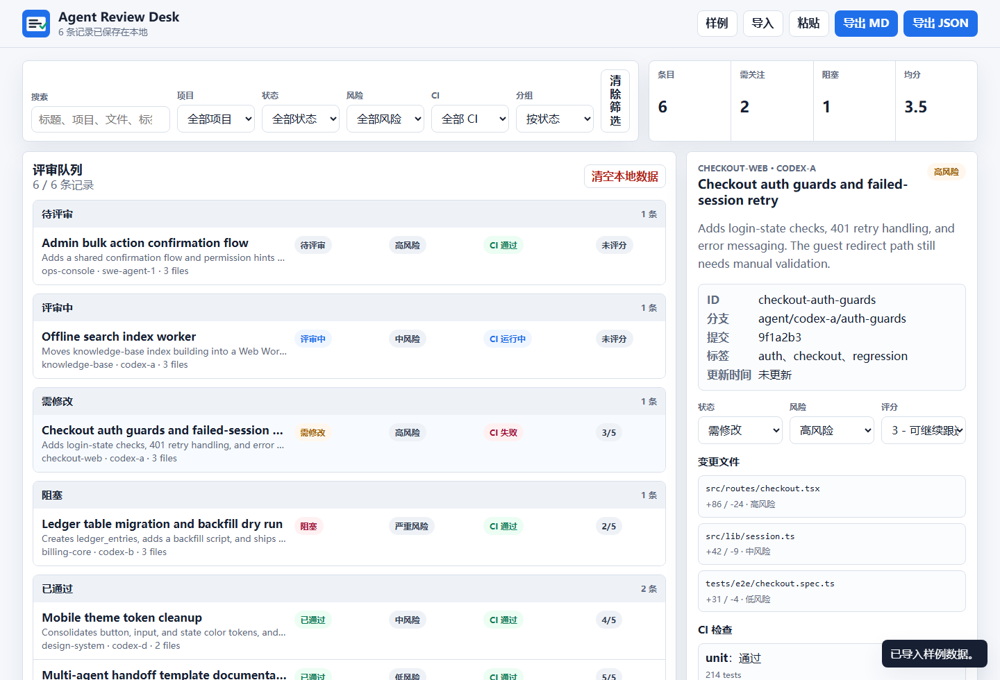

# Agent Review Desk PWA

离线优先的浏览器评审台，面向经常并行运行多个 AI 编码代理的开发者。它可以导入 agent 产物、任务摘要、CI 结果和人工复核信息，按风险、状态、项目、代理或 CI 分组，完成评分、复核意见和 JSON/Markdown 报告导出。



## 30 秒试用

```bash
npm install
npm test
npm run validate:sample
npm run preview
```

打开：

```text
http://localhost:4173/?sample=1
```

`?sample=1` 会自动载入内置样例，适合截图、演示和第一次体验。应用不需要后端服务，导入的数据只保存在当前浏览器的 `localStorage`。

## 它解决什么问题

当你同时让 Codex、Claude Code、Cursor 或内部 agent 改多个分支时，review 通常会变成一堆聊天记录、CI 链接和临时 JSON。Agent Review Desk 把这些交付物放到一个本地看板里：

- 先看阻塞、高风险、CI 失败的 agent 输出。
- 自动把条目分到“现在处理 / 下一批 / 观察 / 已完成”，减少人工排序成本。
- 给每个交付物打分、改状态、补人工复核意见。
- 按项目、风险、状态、agent、CI 分组扫一遍。
- 导出 Markdown 给团队同步，或导出 JSON 给后续自动化。

首屏就是可用工具，不是营销页。项目采用原生 HTML/CSS/JavaScript、PWA manifest、Service Worker 和 Node 内置测试运行器，无前端框架运行时依赖。

## 使用场景

- 同时运行多个 AI 编码代理后，把各自产物集中到一个离线评审台。
- 对任务摘要、变更文件、CI 结果做风险排序，先处理阻塞和高风险项。
- 在浏览器本地记录状态、评分、人工复核意见，避免散落在聊天记录或临时文档里。
- 导出 Markdown 给团队同步，或导出 JSON 交给后续自动化流程。
- 在网络不稳定或不能上传内部代码摘要的环境中离线评审。

## 安装与运行

```bash
npm install
npm test
npm run validate:sample
npm run preview
```

默认预览地址：

```text
http://localhost:4173
```

也可以指定端口：

```bash
PORT=8080 npm run preview
```

在 Windows PowerShell 中：

```powershell
$env:PORT=8080; npm run preview
```

## 静态托管

这是零构建静态 PWA，可以直接托管到 GitHub Pages、Cloudflare Pages、Netlify、Vercel 静态站点或任意内网静态服务器。发布时托管仓库根目录即可；`index.html`、`styles.css`、`src/`、`sample-data/`、`manifest.webmanifest` 和 `sw.js` 都是运行所需文件。

建议 demo 链接使用：

```text
https://your-site.example/agent-review-desk-pwa/?sample=1
```

## 功能

- 导入 JSON 文件、粘贴 JSON 文本、载入内置样例。
- 按标题、项目、代理、分支、提交、摘要、文件路径、标签、CI、复核意见搜索。
- 按项目、状态、风险、CI 筛选。
- 按状态、处理优先级、风险、项目、代理、CI 分组显示评审队列。
- 看板统计条目数、需关注数、阻塞数、平均评分。
- 查看每个条目的摘要、元数据、变更文件、CI 检查和历史复核意见。
- 修改状态、风险、评分，新增复核意见。
- 自动保存到浏览器 `localStorage`。
- 导出当前筛选结果为 Markdown 或 JSON。
- PWA manifest + Service Worker，静态资源和样例数据可离线访问。
- 响应式布局，桌面双栏，窄屏单栏。

## 数据格式

导入数据可以是数组，也可以是包含 `items` 或 `tasks` 数组的对象。

```json
{
  "version": "1.0",
  "source": "my-agent-run",
  "items": [
    {
      "id": "checkout-auth-guards",
      "project": "checkout-web",
      "agent": "codex-a",
      "title": "收银台登录态守卫与失败重试",
      "summary": "新增登录态检查、401 重试和错误提示。",
      "status": "needs-changes",
      "risk": "high",
      "score": 3,
      "branch": "agent/codex-a/auth-guards",
      "commit": "9f1a2b3",
      "tags": ["auth", "checkout"],
      "ci": {
        "status": "failed",
        "url": "",
        "checks": [
          {
            "name": "unit",
            "status": "passed",
            "duration": "48s",
            "details": "214 tests"
          }
        ]
      },
      "files": [
        {
          "path": "src/routes/checkout.tsx",
          "additions": 86,
          "deletions": 24,
          "risk": "high"
        }
      ],
      "notes": [
        {
          "author": "reviewer",
          "text": "需要人工验证未登录用户路径。"
        }
      ]
    }
  ]
}
```

字段说明：

| 字段 | 说明 |
| --- | --- |
| `id` | 条目唯一 ID。缺省时会根据项目和标题生成。 |
| `project` | 项目或仓库名称。 |
| `agent` | 代理名称。 |
| `title` | 任务标题，必填。也兼容 `task` 或 `summary`。 |
| `summary` | 任务摘要。 |
| `status` | `new`、`reviewing`、`needs-changes`、`blocked`、`approved`。 |
| `risk` | `low`、`medium`、`high`、`critical`。缺省时会根据 CI、文件风险、标签和变更规模推断。 |
| `score` | 1 到 5 的评审分，缺省为未评分。 |
| `ci.status` | `passed`、`failed`、`running`、`skipped`、`unknown`。 |
| `files` | 变更文件列表，支持 `path`、`additions`、`deletions`、`risk`。 |
| `notes` | 字符串或对象数组，保存复核意见。 |

## 快捷流程

1. 打开应用，点击“样例”确认界面能力。
2. 点击“导入”选择 agent 输出 JSON，或点击“粘贴”直接贴入 JSON。
3. 用搜索和筛选缩小范围，例如只看 `CI failed` 或 `critical`。
4. 按“风险”或“状态”分组，先处理阻塞和高风险条目。
5. 点选条目，在右侧更新状态、风险、评分，写入复核意见。
6. 导出 Markdown 作为评审报告，或导出 JSON 给后续自动化。

## 从 agent JSON 到 Markdown 报告

最短流程：

1. 让 agent 或 CI 产出 `items` JSON。
2. 在应用里导入文件、粘贴 JSON，或用 `?sample=1` 查看样例结构。
3. 筛选 `CI failed`、`critical`、`blocked`。
4. 在右侧详情面板保存复核状态、风险和评分。
5. 点击“导出 MD”，得到当前筛选结果的 review report。

示例导出会包含总览、分组、每个条目的风险、CI、文件变更和复核意见。

## 自动处理优先级

Agent Review Desk 会根据状态、风险和 CI 自动生成 triage lane：

| Lane | 规则 | 用途 |
| --- | --- | --- |
| 现在处理 | `blocked`、CI failed 或 `critical` 风险 | 先排查阻塞、失败和高爆炸半径交付 |
| 下一批 | `needs-changes`、`high` 风险或 CI running | 需要继续跟进，但不一定马上打断 |
| 观察 | 普通待评审、低/中风险、CI 未知或通过 | 保持在队列里等待常规 review |
| 已完成 | `approved` | 已通过但仍可进入导出记录 |

看板可以按“处理优先级”分组，Markdown 导出也会包含“优先处理队列”，方便把当前最该看的 agent 交付直接发给团队。

快捷键：

- `Ctrl/Command + K`：聚焦搜索。
- `Ctrl/Command + E`：导出当前筛选结果的 Markdown 报告。

## 离线能力与隐私

- 应用是静态 PWA，Service Worker 会缓存 HTML、CSS、JS、manifest、图标和样例数据。
- 导入和编辑后的数据保存在当前浏览器的 `localStorage`。
- 项目不包含真实 token、个人账号或外部 API 调用。
- 默认不会上传任何导入数据；报告导出也在浏览器本地完成。
- 清空本地数据会移除评审数据，但不会卸载 Service Worker 缓存。

## 开发指南

项目结构：

```text
.
├── index.html
├── styles.css
├── manifest.webmanifest
├── sw.js
├── src/
│   ├── app.js
│   ├── domain.js
│   ├── report.js
│   └── storage.js
├── sample-data/
│   └── agent-review-sample.json
├── tests/
├── scripts/
│   ├── preview.js
│   └── validate-sample.js
└── .github/workflows/ci.yml
```

常用命令：

```bash
npm test
npm run validate:sample
npm run preview
```

设计约束：

- 首屏展示实际工具和队列，不做 landing page。
- UI 克制、密集、便于扫描，不使用纯装饰渐变或卡片套卡片。
- 业务规则放在 `src/domain.js`，报告导出放在 `src/report.js`，浏览器交互放在 `src/app.js`。
- 新增字段时优先扩展规范化函数和测试，再接入 UI。

## English

Agent Review Desk PWA is an offline-first browser review desk for developers who run multiple AI coding agents in parallel. It imports agent outputs, task summaries, CI results, changed files, scores, and human review notes, then groups the work by risk, status, project, agent, or CI state.


### 30-Second Tryout

```bash
npm install
npm test
npm run validate:sample
npm run preview
```

Open:

```text
http://localhost:4173/?sample=1
```

The `?sample=1` URL loads bundled sample data automatically. The app has no backend and stores imported review data only in the current browser's `localStorage`.

The first screen is the actual tool, not a marketing page. The project uses native HTML/CSS/JavaScript, a Web App Manifest, a Service Worker, and Node's built-in test runner. There are no frontend framework runtime dependencies.

### Use Cases

- Collect outputs from several AI coding agents in one local review desk.
- Prioritize blocked, failed, high-risk, or critical changes.
- Keep review status, scores, and notes in browser-local storage instead of scattered chat logs.
- Export Markdown for team handoff or JSON for downstream automation.
- Review sensitive summaries offline without uploading data to external services.

### Static Hosting

This is a zero-build static PWA. Host the repository root on GitHub Pages, Cloudflare Pages, Netlify, Vercel static hosting, or an internal static server. Use `?sample=1` for public demos and screenshots.

### Install

```bash
npm install
npm test
npm run validate:sample
npm run preview
```

Preview URL:

```text
http://localhost:4173
```

### Features

- Import JSON files, paste JSON text, or load bundled sample data.
- Search titles, projects, agents, summaries, branches, commits, file paths, tags, CI states, and notes.
- Filter by project, status, risk, and CI state.
- Group by status, risk, project, agent, or CI.
- Group by automatic triage priority, status, risk, project, agent, or CI.
- Auto-classify review work into Now, Next, Watch, and Done lanes from status, risk, and CI signals.
- Edit review status, risk, score, and notes.
- Persist data in `localStorage`.
- Export the current filtered set as Markdown or JSON.
- Offline shell through the Service Worker.
- Responsive desktop and mobile layouts.

### Data Format

The importer accepts either an array or an object with an `items` or `tasks` array. Required item data is intentionally small: provide a title plus any project, agent, risk, status, CI, files, tags, and notes you have. Missing risk can be inferred from CI status, file-level risk, tags, and change size.

### Triage Lanes

The desk derives a review lane for each item: Now for blocked, failed-CI, or critical work; Next for needs-changes, high-risk, or running-CI work; Watch for ordinary open items; Done for approved work. Markdown exports include a priority queue so teams can see what to review first without re-sorting the board.

### Offline Behavior

The Service Worker caches the static application shell and sample data. Imported review data stays in the current browser's `localStorage`. The app does not include real tokens, personal credentials, external API calls, or telemetry.

### Development

Core domain behavior lives in `src/domain.js`; report export lives in `src/report.js`; browser interaction lives in `src/app.js`. Tests are in `tests/*.test.js` and run with `node --test`.
